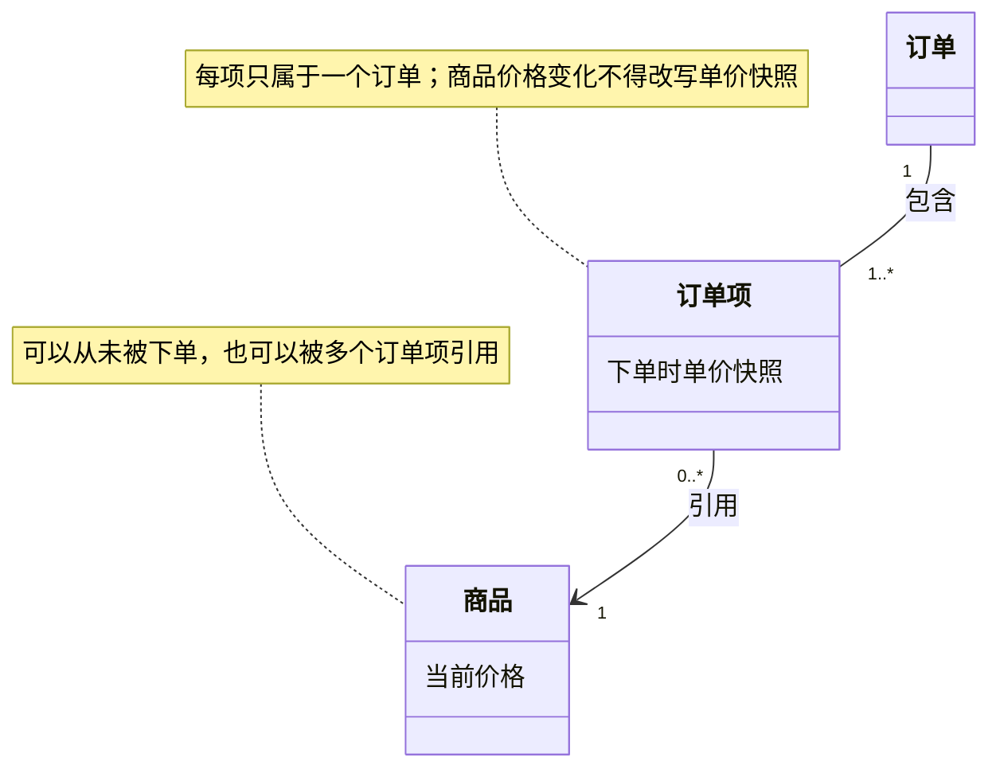

```mermaid
classDiagram
    class 订单
    class 订单项 {
        下单时单价快照
    }
    class 商品 {
        当前价格
    }
    订单 "1" -- "1..*" 订单项 : 包含
    订单项 "0..*" --> "1" 商品 : 引用
    note for 订单项 "每项只属于一个订单；商品价格变化不得改写单价快照"
    note for 商品 "可以从未被下单，也可以被多个订单项引用"
```

这是领域关系：订单至少有一项，每项恰好引用一个商品。历史单价由订单项保留，不随商品当前价格更新。表、外键、级联删除和ORM映射尚未设计，图不表示这些实现已存在。

未渲染验证。
