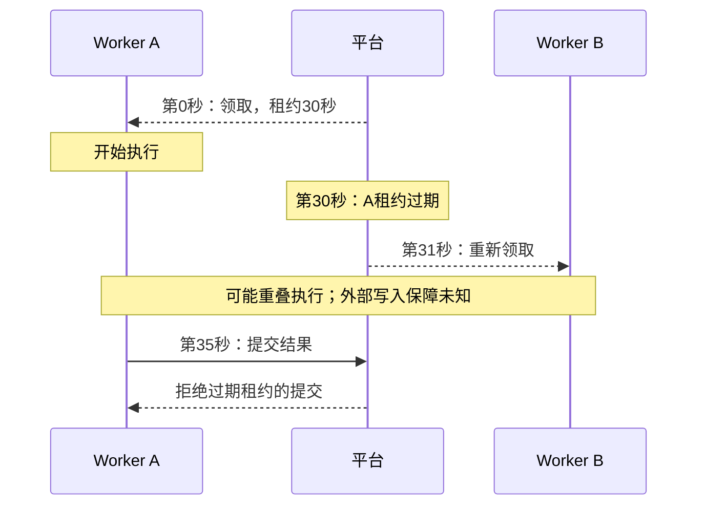

```mermaid
sequenceDiagram
    participant A as Worker A
    participant P as 平台
    participant B as Worker B
    P-->>A: 第0秒：领取，租约30秒
    Note over A: 开始执行
    Note over P: 第30秒：A租约过期
    P-->>B: 第31秒：重新领取
    Note over A,B: 可能重叠执行；外部写入保障未知
    A->>P: 第35秒：提交结果
    P-->>A: 拒绝过期租约的提交
```

“任务只执行一次”不成立：重新领取允许再次执行，拒绝 A 的结果不撤销其已发生的外部写入。A、B 都写入外部系统是允许的反例；需核实幂等或隔离机制，才能判断副作用是否重复。图未渲染验证。
