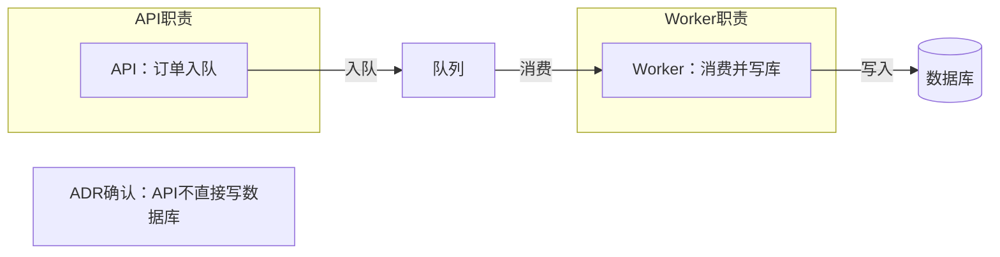

```mermaid
flowchart LR
    subgraph API职责
        A[API：订单入队]
    end
    Q[队列]
    subgraph Worker职责
        W[Worker：消费并写库]
    end
    D[(数据库)]
    A -->|入队| Q
    Q -->|消费| W
    W -->|写入| D
    N[ADR确认：API不直接写数据库]
```

实线是题目提供的行为，ADR 只确认写库边界。选择队列是否为了吞吐、故障隔离或其他目标尚未确认；应查决策记录，不能从当前结构反推出原因。图未渲染验证。
