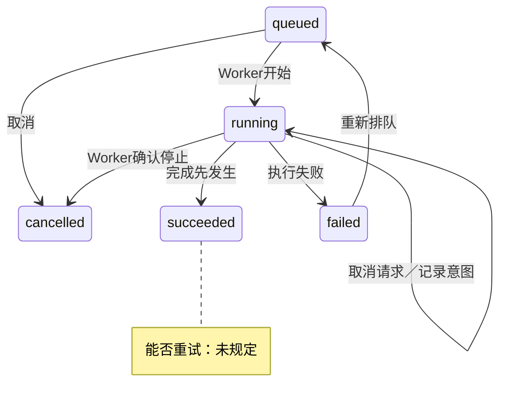

```mermaid
stateDiagram-v2
    queued --> running: Worker开始
    queued --> cancelled: 取消
    running --> running: 取消请求／记录意图
    running --> cancelled: Worker确认停止
    running --> succeeded: 完成先发生
    running --> failed: 执行失败
    failed --> queued: 重新排队
    note right of succeeded
        能否重试：未规定
    end note
```

running 中收到取消请求仍是 running，只有 Worker 确认停止才是 cancelled；完成可能抢先发生，进入 succeeded。取消请求不保证取消完成。succeeded 的重试规则需要确认，图未补造转移。图未渲染验证。
