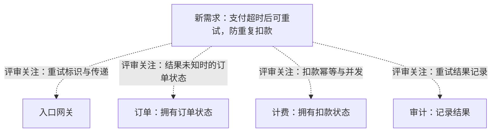

```mermaid
flowchart TB
    R[新需求：支付超时后可重试，防重复扣款]
    G[入口网关]
    O[订单：拥有订单状态]
    B[计费：拥有扣款状态]
    A[审计：记录结果]
    R -.->|评审关注：重试标识与传递| G
    R -.->|评审关注：结果未知时的订单状态| O
    R -.->|评审关注：扣款幂等与并发| B
    R -.->|评审关注：重试结果记录| A
```

虚线只表示评审关注，不证明模块间调用。已知的是各自职责；超时不能直接判为扣款失败。

先核实现有重试/幂等契约，包括标识、去重边界和结果查询；资料不足不等于机制不存在。不足时再决定责任与契约，并验证“外部已扣款后超时”和并发重试不会重复扣款。图未渲染验证。
