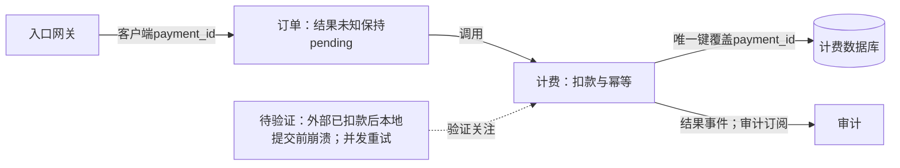

```mermaid
flowchart LR
    G[入口网关] -->|客户端payment_id| O[订单：结果未知保持pending]
    O -->|调用| B[计费：扣款与幂等]
    B -->|唯一键覆盖payment_id| D[(计费数据库)]
    B -->|结果事件；审计订阅| A[审计]
    T[待验证：外部已扣款后本地提交前崩溃；并发重试]
    T -.->|验证关注| B
```

职责、标识传递和唯一键均已确认，继续使用现有机制。本次补齐两类测试：崩溃后重试应能恢复扣款结果且不再次扣款；同一 payment_id 并发重试应只产生一次扣款并得到一致结果。唯一键本身不能证明跨外部扣款与本地提交的崩溃窗口安全；若测试暴露缺口，再定位修复。图未渲染验证。
