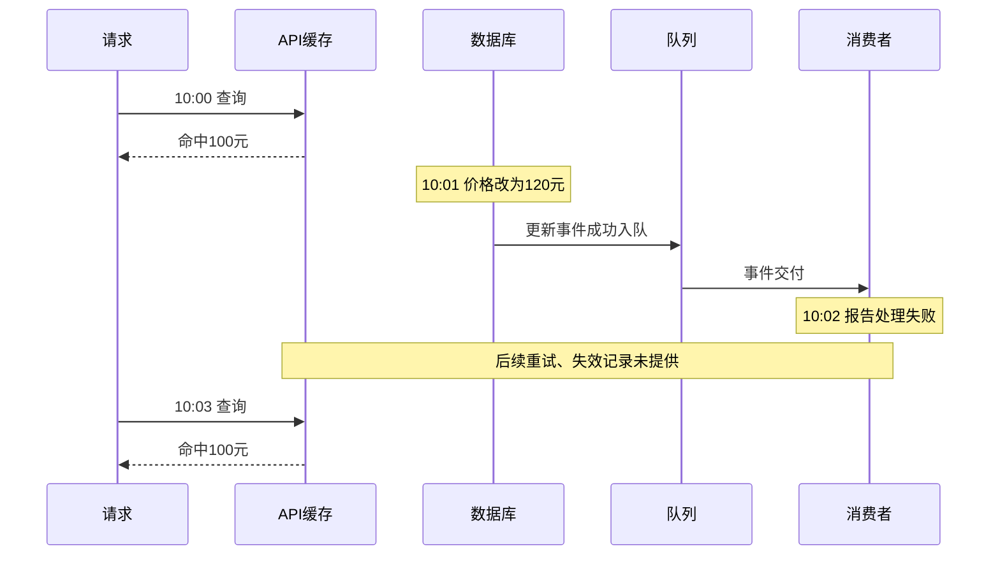

```mermaid
sequenceDiagram
    participant R as 请求
    participant C as API缓存
    participant D as 数据库
    participant Q as 队列
    participant W as 消费者
    R->>C: 10:00 查询
    C-->>R: 命中100元
    Note over D: 10:01 价格改为120元
    D->>Q: 更新事件成功入队
    Q->>W: 事件交付
    Note over W: 10:02 报告处理失败
    Note over W,C: 后续重试、失效记录未提供
    R->>C: 10:03 查询
    C-->>R: 命中100元
```

以上是已知过程，不能据时间先后认定消费失败导致旧价。候选原因包括失败阻断失效、重试未成功、失效目标错误，或 TTL 尚未到期；TTL 为10分钟，但未给出该条目的写入及续期时间。

下一步按事件 ID 查失败点、重试/死信和失效记录，再对照请求的缓存键、写入时间与到期时间。由证据确定旧条目为何仍可命中。图未渲染验证。
