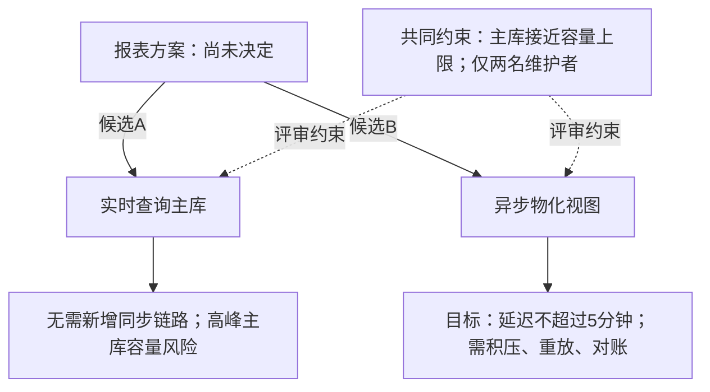

```mermaid
flowchart TB
    Q[报表方案：尚未决定]
    Q -->|候选A| R[实时查询主库]
    Q -->|候选B| M[异步物化视图]
    R --> RA[无需新增同步链路；高峰主库容量风险]
    M --> MA[目标：延迟不超过5分钟；需积压、重放、对账]
    C[共同约束：主库接近容量上限；仅两名维护者]
    C -.->|评审约束| R
    C -.->|评审约束| M
```

建议优先验证物化视图：可接受的延迟给它空间，但新增维护负担必须由两人承担。它是否降低主库负载、能否稳定满足5分钟均待验证。

决策证据：测报表查询成本及高峰主库余量；测物化链路在峰值和故障恢复时的延迟、积压，并估算重放/对账维护成本。实时方案若仍有足够余量可选；否则只有物化方案同时满足延迟与维护约束时才采用，两者均不满足则需调整方案。图未渲染验证。
