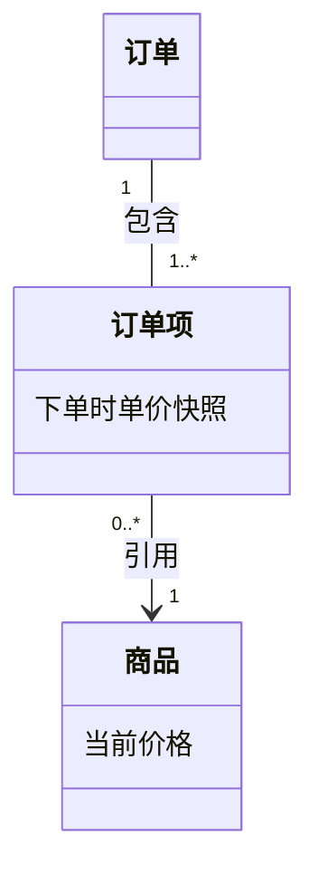

```mermaid
classDiagram
    class 订单
    class 订单项 {
        下单时单价快照
    }
    class 商品 {
        当前价格
    }
    订单 "1" -- "1..*" 订单项 : 包含
    订单项 "0..*" --> "1" 商品 : 引用
```

这是领域关系：订单至少含一项，每项只属于一个订单且引用一个商品；商品可被零个或多个订单项引用。订单项单价在下单时固定，商品当前价格变化不得改写历史快照。图不声明数据库表、外键、级联删除或 ORM 实现。图未渲染验证。
