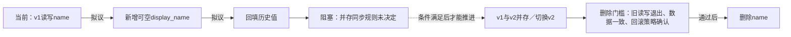

一次回填后，v1 仍可能更新 name，display_name 随即落后；v2 更新 display_name 后，回滚到 v1 也可能读到旧值。并存同步未定，直接切换有数据分歧风险。

先决定并存期的权威值、同步方向、冲突规则，以及 v2 遇到空值的行为；再验证并发写入、回填期间写入、同步失败恢复和回滚的数据一致性。以上是缺少的条件，不能假定已双写。

只有全部 v1 及其他 name 读写方退出、历史与后续数据一致性已验证，且回滚窗口结束或已有不依赖 name 的回退方案，才能删除 name。删除后直接回滚 v1 会缺字段；保留字段也不自动保证回滚数据正确。图未渲染验证。
