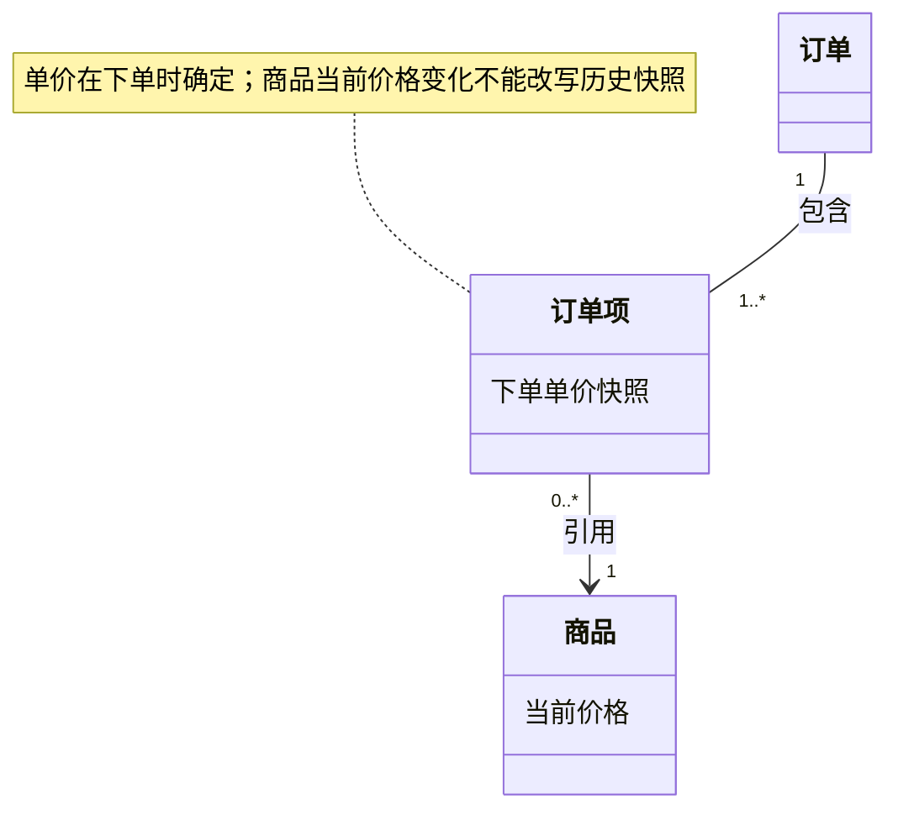

```mermaid
classDiagram
    class Order["订单"]
    class Item["订单项"] {
        下单单价快照
    }
    class Product["商品"] {
        当前价格
    }
    Order "1" -- "1..*" Item : 包含
    Item "0..*" --> "1" Product : 引用
    note for Item "单价在下单时确定；商品当前价格变化不能改写历史快照"
```

每个订单至少有一个订单项，每个订单项只属于一个订单并引用一个商品；商品可被零个或多个订单项引用。

这是领域关系及价格约束。图中未规定表、外键、级联删除或ORM实现。
