# 第一轮：独立生成的原始回答对照

这里只汇集原文件，不改写答案。图形是否显示取决于阅读平台；本次验证了语法，没有验证布局。第二轮文件见主报告。

## 01-lease

Worker A 领取任务，租约为30秒。A在第35秒提交，期间Worker B在第31秒重新领取。平台会拒绝过期租约的结果提交，但题目没有提供对外部写入的幂等或隔离保证。画出时序并判断“任务只执行一次”是否成立。请简短中文回答，不写项目文档。

### show-me

[原文件](outputs/show-me/01-lease.md)

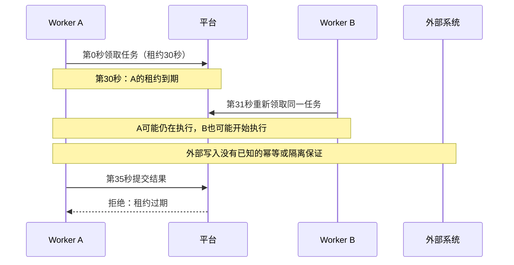

**“任务只执行一次”不成立。** 拒绝A的过期结果，并不等于停止A执行或撤销其外部写入；A、B可能重复执行并产生重复副作用。租约校验只能挡住这次过期提交。


### visual-explanation

[原文件](outputs/visual-explanation/01-lease.md)

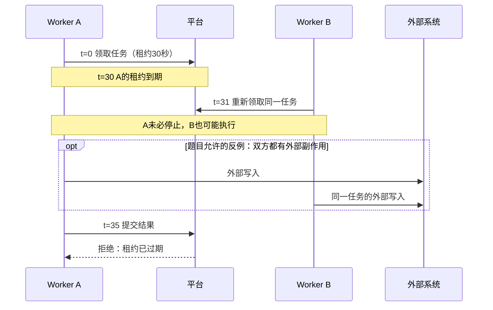

“任务只执行一次”不成立：同一任务已被领取两次，过期提交被拒绝并不能撤销外部写入，也不能证明 A 已停止。上图双重写入是允许的反例，不是已发生的事实；题目没有提供外部写入的幂等或隔离保证。

来源：题目给定时序与约束。未渲染验证。


### mermaid-diagrams

[原文件](outputs/mermaid-diagrams/01-lease.md)

“任务只执行一次”不能成立：租约只约束平台接受结果，不能保证执行和外部副作用只发生一次。

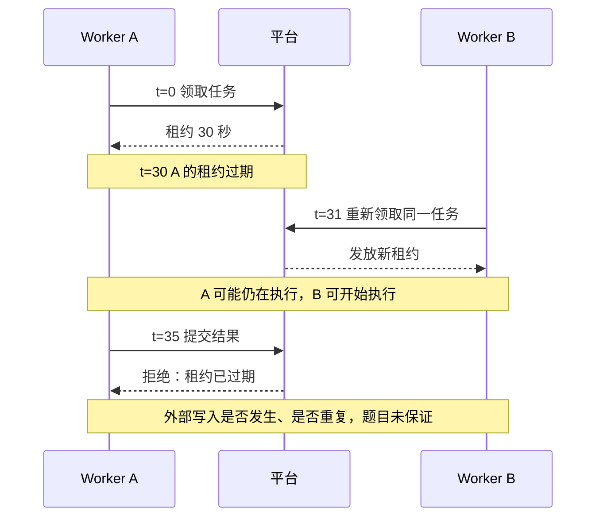

A 的提交被拒绝不等于其外部写入被撤销或阻止；没有幂等或隔离保证，重复副作用仍可能发生。


## 02-intent

已知API将订单入队，Worker消费队列并写入数据库；ADR只确认API不直接写数据库。没有吞吐、隔离故障或选择队列原因的资料。画出职责边界，说明哪些是事实，哪些设计原因尚未确认。请简短中文回答，不写项目文档。

### show-me

[原文件](outputs/show-me/02-intent.md)

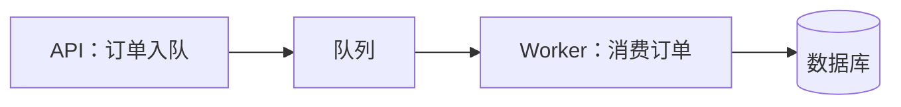

已知事实：API负责入队，Worker负责消费并写数据库；ADR确认API不直接写数据库。

尚未确认：为何选队列、是否为了提高吞吐或隔离故障。图中的职责分工不能证明这些设计动机。


### visual-explanation

[原文件](outputs/visual-explanation/02-intent.md)

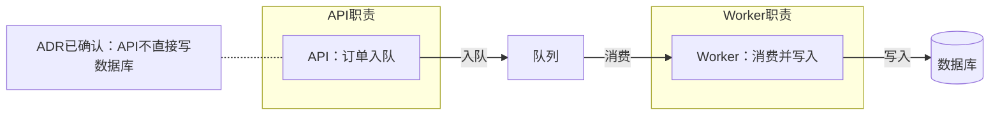

事实：API 入队；Worker 消费队列并写数据库。已确认设计意图：ADR 规定 API 不直接写数据库。

采用队列是否为了吞吐、隔离故障或其他原因，输入未提供资料，尚未确认；不能由这张职责图反推出设计原因。

来源：题目给定行为与 ADR 摘要。未渲染验证。


### mermaid-diagrams

[原文件](outputs/mermaid-diagrams/02-intent.md)

已知职责边界如下：

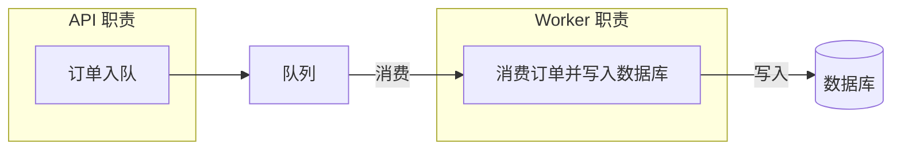

事实：API 入队，Worker 消费并写数据库；ADR 确认 API 不直接写数据库。

尚未确认：为何选择队列、是否为提高吞吐或隔离故障。这些是可能的理由，不能当作既定设计意图。


## 03-diff

旧逻辑：每次save都write。新逻辑：内容未变化时直接返回缓存；变化时write再失效缓存。用最容易看懂的方式说明改动。请简短中文回答，不写项目文档。

### show-me

[原文件](outputs/show-me/03-diff.md)

```diff
 on(save)
-  write(content)
+  if content is unchanged
+    return cached result
+  write(content)
+  invalidate cache
```

未变化时复用缓存，跳过写入；变化时先写入，再让缓存失效。


### visual-explanation

[原文件](outputs/visual-explanation/03-diff.md)

```diff
 on(save)
+  if content is unchanged
+    return cached result
   write content
+  invalidate cache
```

以前每次 `save` 都写；现在未变化就返回缓存，变化则先写入、再失效缓存。图中只表达题目给定的正常流程，写入失败时的处理未提供。

来源：题目给定的新旧逻辑。diff 源文本已检查，未渲染验证。


### mermaid-diagrams

[原文件](outputs/mermaid-diagrams/03-diff.md)

改动是为 `save` 增加“内容是否变化”的判断：

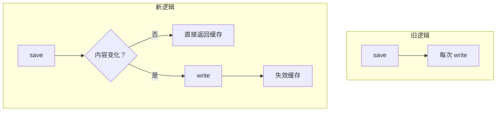

未变化时省去写入；变化时先写入，再失效缓存。


## 04-state

一个任务有 queued、running、succeeded、failed、cancelled 五种状态。queued 可取消；running 收到取消请求后，只记录取消意图，只有 Worker 确认停止才进入 cancelled。running 也可能先完成并进入 succeeded。failed 可重新排队。没有规定 succeeded 能否再次重试。请画状态关系并解释取消请求与取消完成的区别。简短中文，不写项目文档。

### show-me

[原文件](outputs/show-me/04-state.md)

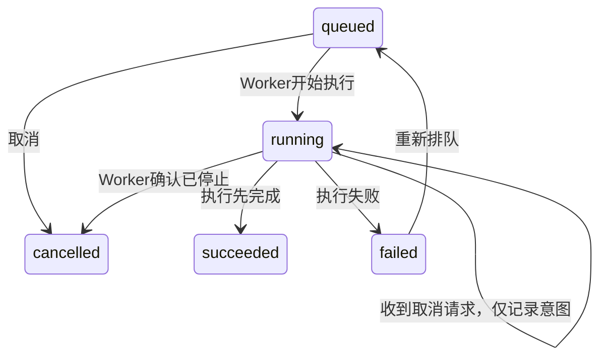

**取消请求 ≠ 取消完成。** running收到请求后仍是running；只有Worker确认停止，才进入cancelled。若执行先完成，仍可能进入succeeded。

succeeded能否重试未规定，因此不画重试边；running→failed是按状态名称理解的失败路径，题目未细述触发条件。


### visual-explanation

[原文件](outputs/visual-explanation/04-state.md)

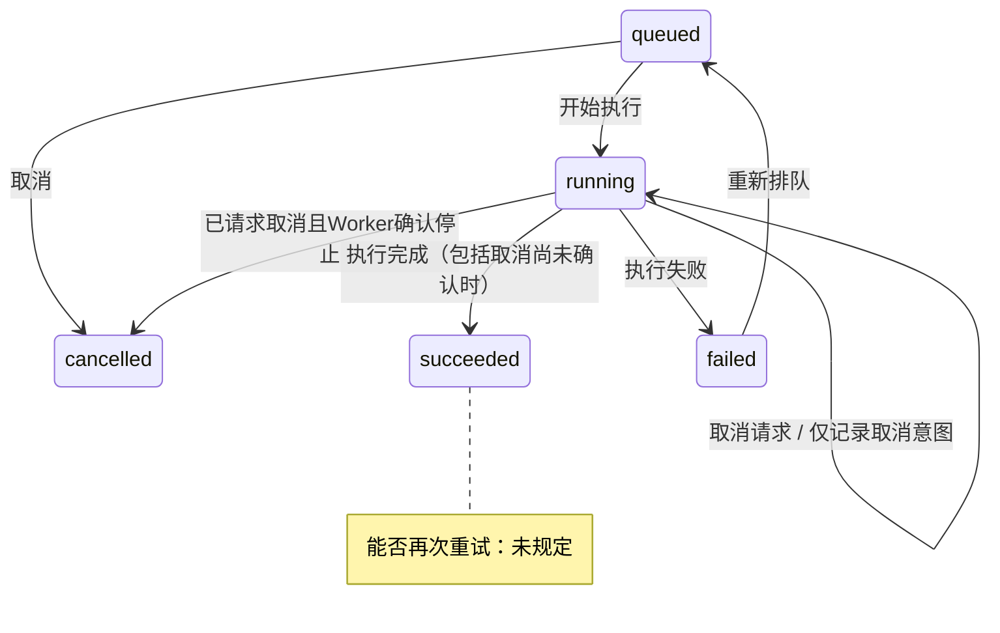

取消请求只记录意图，任务仍为 `running`；Worker 确认停止后才是 `cancelled`。若先完成，任务进入 `succeeded`，所以取消请求不保证最终取消。

来源：题目状态规则；`queued → running`、`running → failed` 按状态含义推断。未为 `succeeded` 添加重试边，因为规则未规定。未渲染验证。


### mermaid-diagrams

[原文件](outputs/mermaid-diagrams/04-state.md)

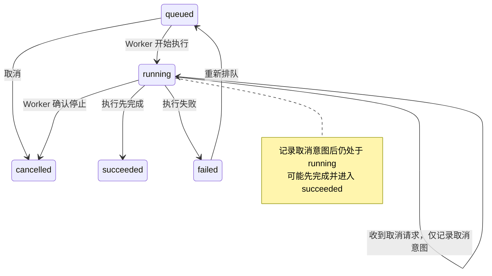

取消请求只是表达停止意图；取消完成需要 Worker 确认停止，此时才进入 `cancelled`。`succeeded` 能否重试未规定，图中不添加该转移。


## 05-scope

系统有入口网关、订单模块、计费模块和审计模块。已有决定：订单拥有订单状态，计费拥有扣款状态，审计记录结果。新需求允许支付超时后重试，必须防止重复扣款。没有现成的幂等设计资料。请用图帮助评审影响边界，区分已知职责和需要决定/验证的地方。简短中文，不写项目文档。

### show-me

[原文件](outputs/show-me/05-scope.md)

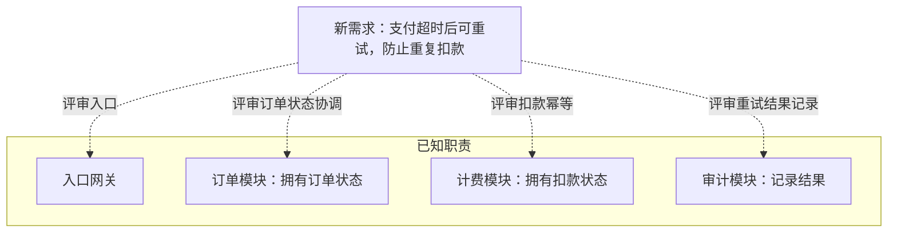

实线框内是已有职责；虚线表示影响评审范围，未声明现有调用链。

需要决定或验证：

- 网关是否接受重试、由谁发起重试，如何识别同一笔支付。
- 计费如何复用同一幂等标识、持久化去重，并处理并发重试。
- 超时后原扣款可能已成功，如何查证结果并协调订单状态。
- 审计如何关联多次尝试及最终结果。

这些是待评审问题，现有资料尚不能证明已防止重复扣款。


### visual-explanation

[原文件](outputs/visual-explanation/05-scope.md)

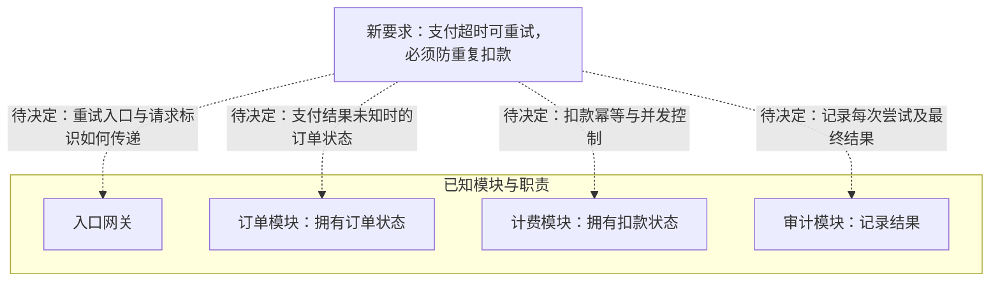

实线边框内是题目已确认的模块和职责；虚线是评审影响，尚未确认模块调用关系或具体方案。超时只说明未及时收到结果，不能据此判定未扣款。

建议围绕计费边界决定：同一支付操作重试使用稳定幂等键，明确键的范围、保存期限，以及并发请求如何原子地认领并复用结果。若存在外部支付方，还需确认它支持幂等或结果查询；仅在本地去重不能自动解决“外部已扣款、本地未记账”的窗口。

需验证：首次扣款成功但响应丢失、并发重试、进程在扣款后崩溃时，是否仍只发生一次扣款；订单与审计如何获得最终结果。以上均是待决方案或验证项，题目没有现成幂等设计资料。

来源：题目给定职责与新需求。未渲染验证。


### mermaid-diagrams

[原文件](outputs/mermaid-diagrams/05-scope.md)

图中节点写明已知职责；虚线表示待评审的影响关联，不表示已确认的调用链。

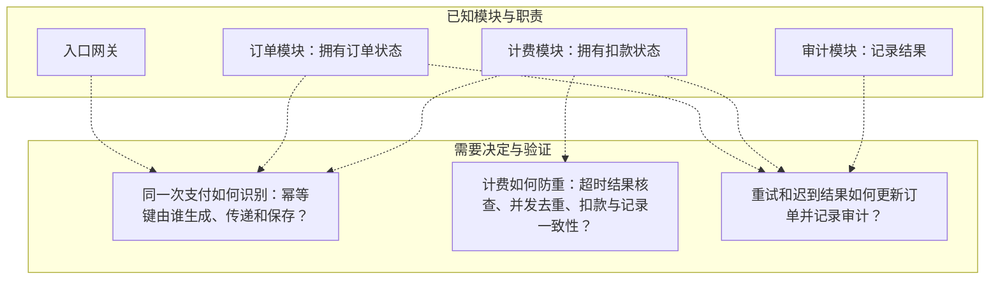

新要求已明确：允许支付超时后重试，且必须防止重复扣款。超时不等于扣款失败，不能直接按失败重新扣款。

幂等方案尚未确定。评审需决定上述契约，并验证“扣款成功但响应超时”、并发重试和迟到结果下不会重复扣款，订单与审计能反映最终结果。

