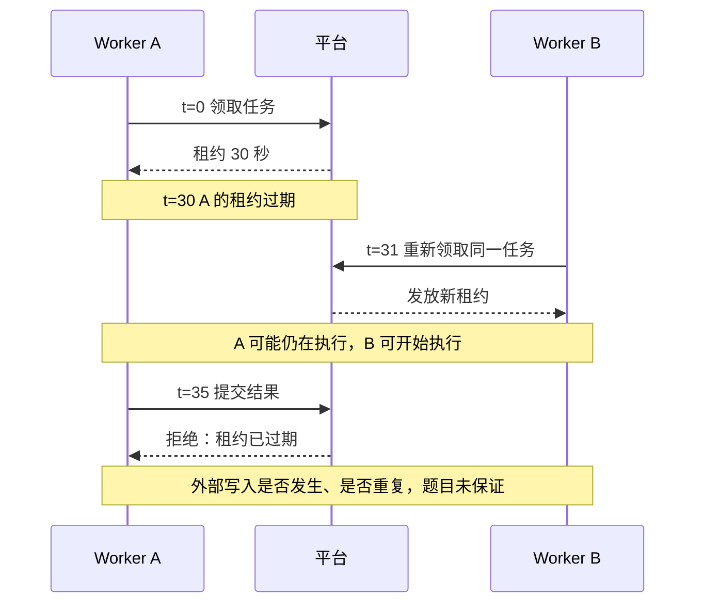

“任务只执行一次”不能成立：租约只约束平台接受结果，不能保证执行和外部副作用只发生一次。

```mermaid
sequenceDiagram
    participant A as Worker A
    participant P as 平台
    participant B as Worker B
    A->>P: t=0 领取任务
    P-->>A: 租约 30 秒
    Note over A,P: t=30 A 的租约过期
    B->>P: t=31 重新领取同一任务
    P-->>B: 发放新租约
    Note over A,B: A 可能仍在执行，B 可开始执行
    A->>P: t=35 提交结果
    P-->>A: 拒绝：租约已过期
    Note over A,B: 外部写入是否发生、是否重复，题目未保证
```

A 的提交被拒绝不等于其外部写入被撤销或阻止；没有幂等或隔离保证，重复副作用仍可能发生。
