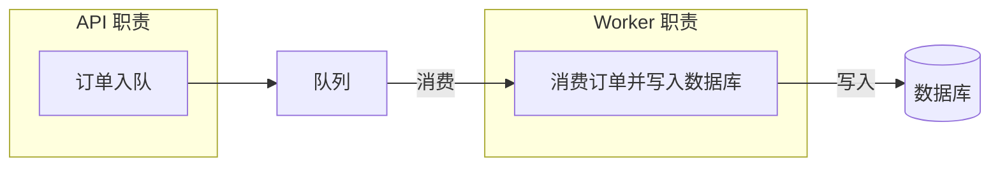

已知职责边界如下：

```mermaid
flowchart LR
    subgraph Entry[API 职责]
        API[订单入队]
    end
    Q[队列]
    subgraph Execution[Worker 职责]
        W[消费订单并写入数据库]
    end
    DB[(数据库)]
    API --> Q
    Q -->|消费| W
    W -->|写入| DB
    %% ADR 确认 API 不直接写数据库，因此不画该连接
```

事实：API 入队，Worker 消费并写数据库；ADR 确认 API 不直接写数据库。

尚未确认：为何选择队列、是否为提高吞吐或隔离故障。这些是可能的理由，不能当作既定设计意图。
