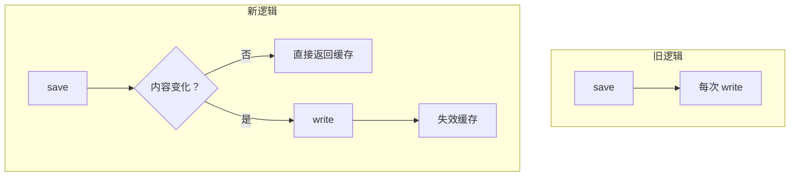

改动是为 `save` 增加“内容是否变化”的判断：

```mermaid
flowchart TD
    subgraph Old[旧逻辑]
        O[save] --> OW[每次 write]
    end
    subgraph New[新逻辑]
        N[save] --> C{内容变化？}
        C -->|否| R[直接返回缓存]
        C -->|是| W[write]
        W --> I[失效缓存]
    end
```

未变化时省去写入；变化时先写入，再失效缓存。
