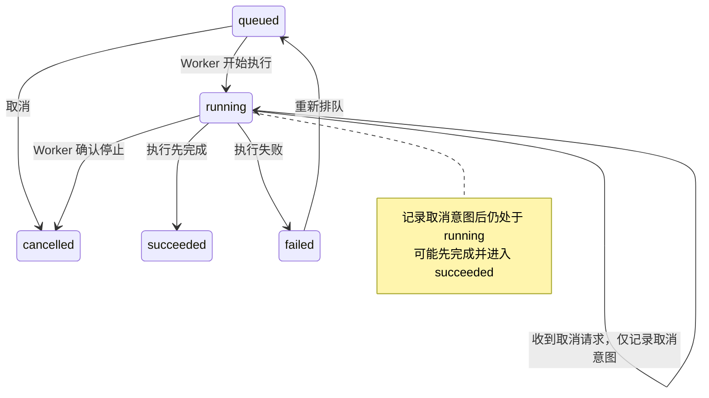

```mermaid
stateDiagram-v2
    queued --> running: Worker 开始执行
    queued --> cancelled: 取消
    running --> running: 收到取消请求，仅记录取消意图
    running --> cancelled: Worker 确认停止
    running --> succeeded: 执行先完成
    running --> failed: 执行失败
    failed --> queued: 重新排队
    note right of running
        记录取消意图后仍处于 running
        可能先完成并进入 succeeded
    end note
```

取消请求只是表达停止意图；取消完成需要 Worker 确认停止，此时才进入 `cancelled`。`succeeded` 能否重试未规定，图中不添加该转移。
