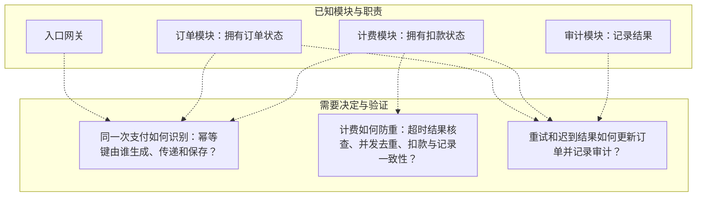

图中节点写明已知职责；虚线表示待评审的影响关联，不表示已确认的调用链。

```mermaid
flowchart TB
    subgraph Known[已知模块与职责]
        G[入口网关]
        O[订单模块：拥有订单状态]
        B[计费模块：拥有扣款状态]
        A[审计模块：记录结果]
    end
    subgraph Review[需要决定与验证]
        K[同一次支付如何识别：幂等键由谁生成、传递和保存？]
        D[计费如何防重：超时结果核查、并发去重、扣款与记录一致性？]
        R[重试和迟到结果如何更新订单并记录审计？]
    end
    G -.-> K
    O -.-> K
    B -.-> K
    B -.-> D
    O -.-> R
    B -.-> R
    A -.-> R
```

新要求已明确：允许支付超时后重试，且必须防止重复扣款。超时不等于扣款失败，不能直接按失败重新扣款。

幂等方案尚未确定。评审需决定上述契约，并验证“扣款成功但响应超时”、并发重试和迟到结果下不会重复扣款，订单与审计能反映最终结果。
