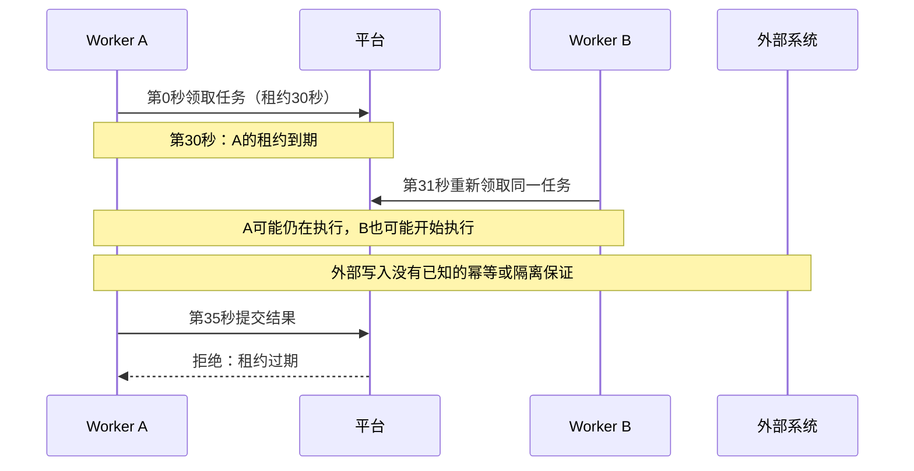

```mermaid
sequenceDiagram
    participant A as Worker A
    participant P as 平台
    participant B as Worker B
    participant E as 外部系统
    A->>P: 第0秒领取任务（租约30秒）
    Note over A,P: 第30秒：A的租约到期
    B->>P: 第31秒重新领取同一任务
    Note over A,B: A可能仍在执行，B也可能开始执行
    Note over A,E: 外部写入没有已知的幂等或隔离保证
    A->>P: 第35秒提交结果
    P-->>A: 拒绝：租约过期
```

**“任务只执行一次”不成立。** 拒绝A的过期结果，并不等于停止A执行或撤销其外部写入；A、B可能重复执行并产生重复副作用。租约校验只能挡住这次过期提交。
