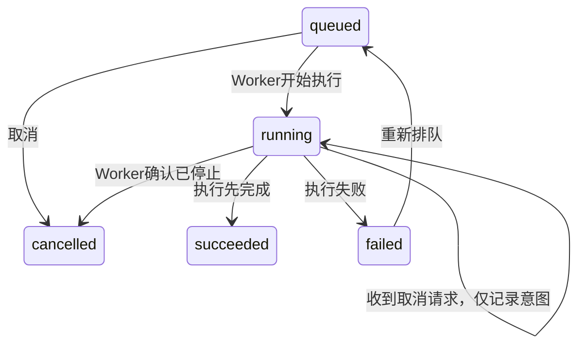

```mermaid
stateDiagram-v2
    queued --> running: Worker开始执行
    queued --> cancelled: 取消
    running --> running: 收到取消请求，仅记录意图
    running --> cancelled: Worker确认已停止
    running --> succeeded: 执行先完成
    running --> failed: 执行失败
    failed --> queued: 重新排队
```

**取消请求 ≠ 取消完成。** running收到请求后仍是running；只有Worker确认停止，才进入cancelled。若执行先完成，仍可能进入succeeded。

succeeded能否重试未规定，因此不画重试边；running→failed是按状态名称理解的失败路径，题目未细述触发条件。
