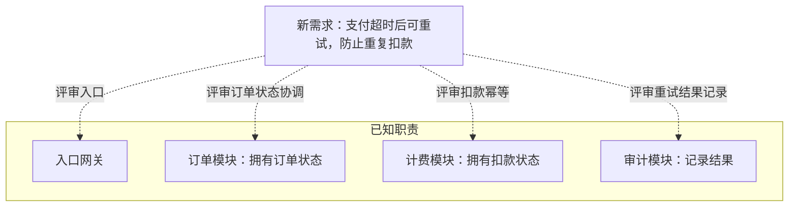

```mermaid
flowchart TB
    subgraph Known[已知职责]
        G[入口网关]
        O[订单模块：拥有订单状态]
        B[计费模块：拥有扣款状态]
        A[审计模块：记录结果]
    end
    R[新需求：支付超时后可重试，防止重复扣款]
    R -.评审入口.-> G
    R -.评审订单状态协调.-> O
    R -.评审扣款幂等.-> B
    R -.评审重试结果记录.-> A
```

实线框内是已有职责；虚线表示影响评审范围，未声明现有调用链。

需要决定或验证：

- 网关是否接受重试、由谁发起重试，如何识别同一笔支付。
- 计费如何复用同一幂等标识、持久化去重，并处理并发重试。
- 超时后原扣款可能已成功，如何查证结果并协调订单状态。
- 审计如何关联多次尝试及最终结果。

这些是待评审问题，现有资料尚不能证明已防止重复扣款。
