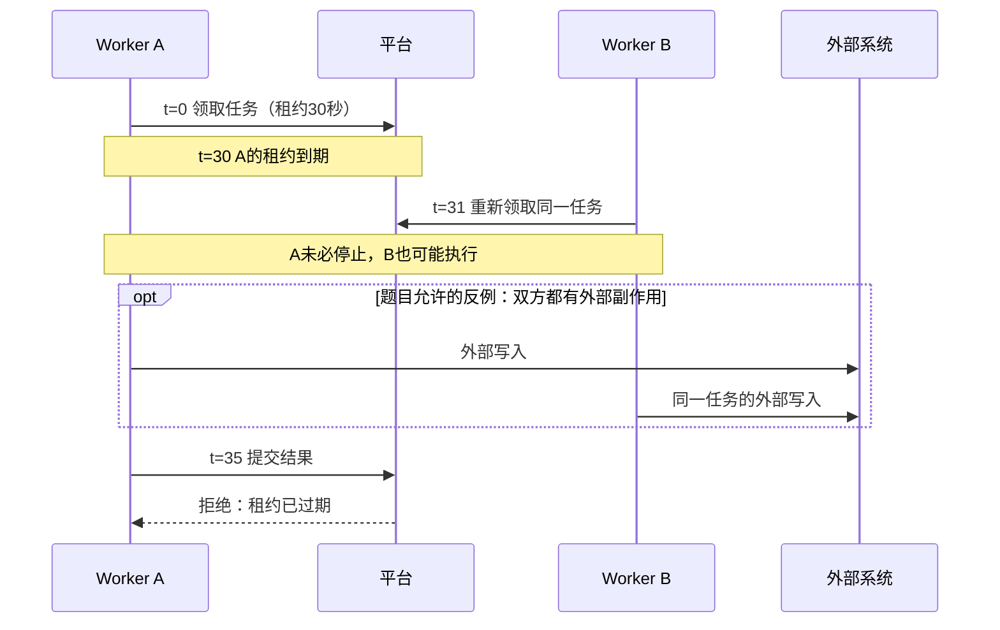

```mermaid
sequenceDiagram
    participant A as Worker A
    participant P as 平台
    participant B as Worker B
    participant E as 外部系统
    A->>P: t=0 领取任务（租约30秒）
    Note over A,P: t=30 A的租约到期
    B->>P: t=31 重新领取同一任务
    Note over A,B: A未必停止，B也可能执行
    opt 题目允许的反例：双方都有外部副作用
        A->>E: 外部写入
        B->>E: 同一任务的外部写入
    end
    A->>P: t=35 提交结果
    P-->>A: 拒绝：租约已过期
```

“任务只执行一次”不成立：同一任务已被领取两次，过期提交被拒绝并不能撤销外部写入，也不能证明 A 已停止。上图双重写入是允许的反例，不是已发生的事实；题目没有提供外部写入的幂等或隔离保证。

来源：题目给定时序与约束。未渲染验证。
