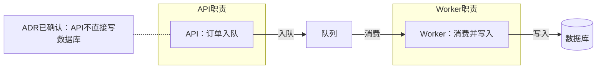

```mermaid
flowchart LR
    subgraph API边界[API职责]
        A[API：订单入队]
    end
    Q[队列]
    subgraph Worker边界[Worker职责]
        W[Worker：消费并写入]
    end
    D[(数据库)]
    A -->|入队| Q
    Q -->|消费| W
    W -->|写入| D
    N[ADR已确认：API不直接写数据库]
    N -.- A
```

事实：API 入队；Worker 消费队列并写数据库。已确认设计意图：ADR 规定 API 不直接写数据库。

采用队列是否为了吞吐、隔离故障或其他原因，输入未提供资料，尚未确认；不能由这张职责图反推出设计原因。

来源：题目给定行为与 ADR 摘要。未渲染验证。
