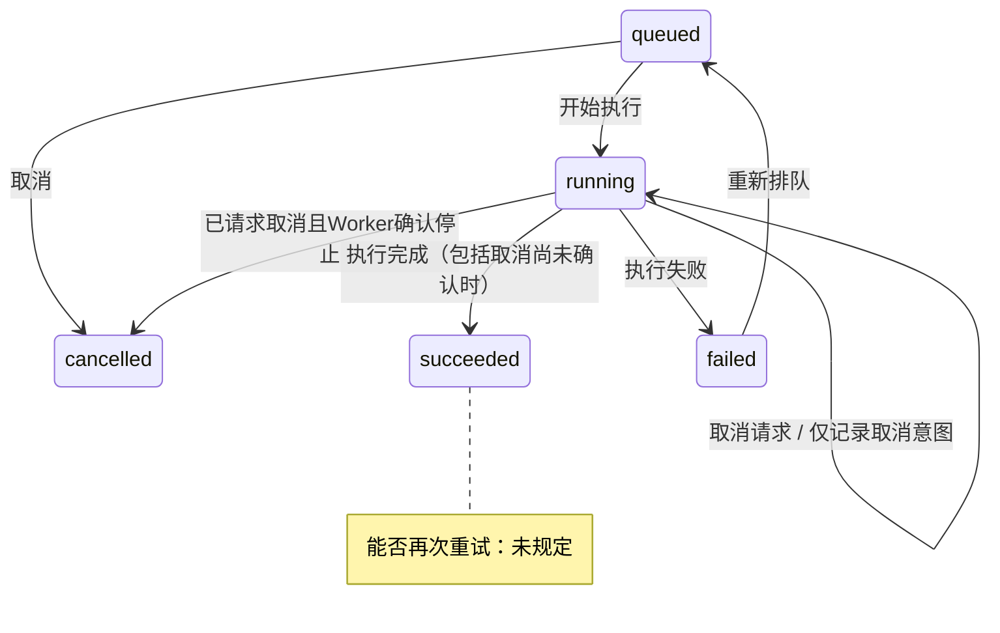

```mermaid
stateDiagram-v2
    queued --> running: 开始执行
    queued --> cancelled: 取消
    running --> running: 取消请求 / 仅记录取消意图
    running --> cancelled: 已请求取消且Worker确认停止
    running --> succeeded: 执行完成（包括取消尚未确认时）
    running --> failed: 执行失败
    failed --> queued: 重新排队
    note right of succeeded
        能否再次重试：未规定
    end note
```

取消请求只记录意图，任务仍为 `running`；Worker 确认停止后才是 `cancelled`。若先完成，任务进入 `succeeded`，所以取消请求不保证最终取消。

来源：题目状态规则；`queued → running`、`running → failed` 按状态含义推断。未为 `succeeded` 添加重试边，因为规则未规定。未渲染验证。
