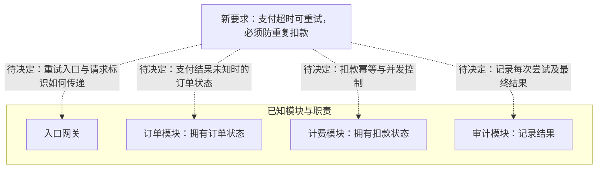

实线边框内是题目已确认的模块和职责；虚线是评审影响，尚未确认模块调用关系或具体方案。超时只说明未及时收到结果，不能据此判定未扣款。

建议围绕计费边界决定：同一支付操作重试使用稳定幂等键，明确键的范围、保存期限，以及并发请求如何原子地认领并复用结果。若存在外部支付方，还需确认它支持幂等或结果查询；仅在本地去重不能自动解决“外部已扣款、本地未记账”的窗口。

需验证：首次扣款成功但响应丢失、并发重试、进程在扣款后崩溃时，是否仍只发生一次扣款；订单与审计如何获得最终结果。以上均是待决方案或验证项，题目没有现成幂等设计资料。

来源：题目给定职责与新需求。未渲染验证。
