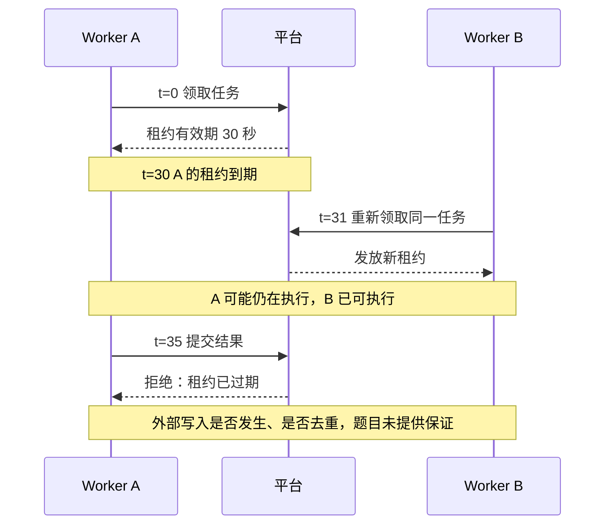

```mermaid
sequenceDiagram
    participant A as Worker A
    participant P as 平台
    participant B as Worker B
    A->>P: t=0 领取任务
    P-->>A: 租约有效期 30 秒
    Note over A,P: t=30 A 的租约到期
    B->>P: t=31 重新领取同一任务
    P-->>B: 发放新租约
    Note over A,B: A 可能仍在执行，B 已可执行
    A->>P: t=35 提交结果
    P-->>A: 拒绝：租约已过期
    Note over A,B: 外部写入是否发生、是否去重，题目未提供保证
```

“任务只执行一次”不成立为保证：租约只限制平台接受结果，不能证明旧 Worker 已停止，也不能阻止外部副作用。A、B 可能重复执行或写入；不能断言已经发生重复写入。
