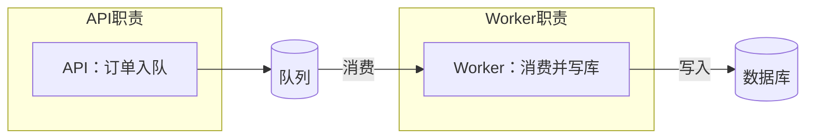

```mermaid
flowchart LR
    subgraph API职责
        A[API：订单入队]
    end
    Q[(队列)]
    subgraph Worker职责
        W[Worker：消费并写库]
    end
    D[(数据库)]
    A --> Q
    Q -->|消费| W
    W -->|写入| D
```

事实：API 入队，Worker 消费并写数据库；ADR 明确 API 不直接写数据库。为何选择队列尚未确认，不能据此认定原因是提高吞吐或隔离故障；这些动机需要补充资料。
