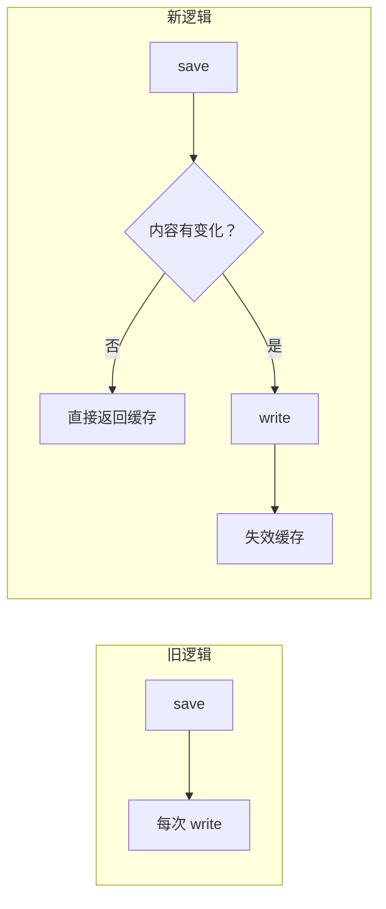

```mermaid
flowchart LR
    subgraph 旧逻辑
        O[save] --> OW[每次 write]
    end
    subgraph 新逻辑
        N[save] --> C{内容有变化？}
        C -->|否| R[直接返回缓存]
        C -->|是| W[write] --> I[失效缓存]
    end
```

改动：未变化时跳过写入、直接返回缓存；变化时仍写入，并在写入后失效缓存。
