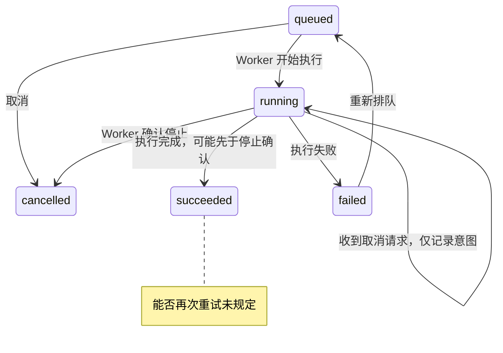

```mermaid
stateDiagram-v2
    queued --> running: Worker 开始执行
    queued --> cancelled: 取消
    running --> running: 收到取消请求，仅记录意图
    running --> cancelled: Worker 确认停止
    running --> succeeded: 执行完成，可能先于停止确认
    running --> failed: 执行失败
    failed --> queued: 重新排队
    note right of succeeded
        能否再次重试未规定
    end note
```

取消请求是意图，任务仍处于 running；Worker 确认停止才是取消完成、进入 cancelled。请求取消后也可能先完成并进入 succeeded。succeeded 的重试规则未知，因此不画重试边。
