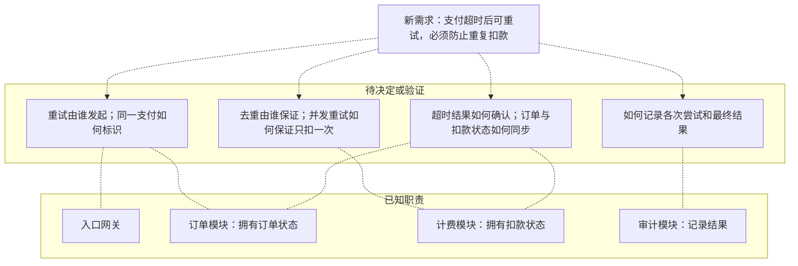

```mermaid
flowchart TB
    R[新需求：支付超时后可重试，必须防止重复扣款]
    subgraph 已知职责
        G[入口网关]
        O[订单模块：拥有订单状态]
        B[计费模块：拥有扣款状态]
        A[审计模块：记录结果]
    end
    subgraph 待决定或验证
        D1[重试由谁发起；同一支付如何标识]
        D2[去重由谁保证；并发重试如何保证只扣一次]
        D3[超时结果如何确认；订单与扣款状态如何同步]
        D4[如何记录各次尝试和最终结果]
    end
    R -.-> D1
    R -.-> D2
    R -.-> D3
    R -.-> D4
    D1 -.- G
    D1 -.- O
    D2 -.- B
    D3 -.- O
    D3 -.- B
    D4 -.- A
```

虚线表示评审影响关联，不代表已有调用链或已定方案。职责已明确，幂等设计尚未确认。重点验证：超时前可能已扣款，重试须识别同一支付，并覆盖并发、迟到结果与状态同步；不能把超时直接视作扣款失败。
