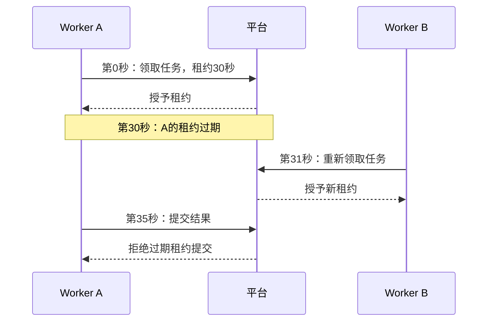

```mermaid
sequenceDiagram
    participant A as Worker A
    participant P as 平台
    participant B as Worker B
    A->>P: 第0秒：领取任务，租约30秒
    P-->>A: 授予租约
    Note over A,P: 第30秒：A的租约过期
    B->>P: 第31秒：重新领取任务
    P-->>B: 授予新租约
    A->>P: 第35秒：提交结果
    P-->>A: 拒绝过期租约提交
```

“任务只执行一次”不成立：A、B均可执行任务。拒绝A提交只限制平台接收结果；没有外部写入的幂等或隔离保证，不能排除重复副作用。
