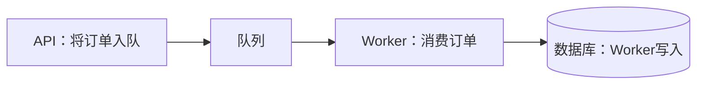

```mermaid
flowchart LR
    API[API：将订单入队] --> Q[队列]
    Q --> W[Worker：消费订单]
    W --> DB[(数据库：Worker写入)]
```

已知事实：API入队，Worker消费并写数据库；ADR确认API不直接写数据库。

尚未确认：为何选择队列、吞吐收益、故障隔离目标及保证。不能从职责分工推断这些设计原因。
