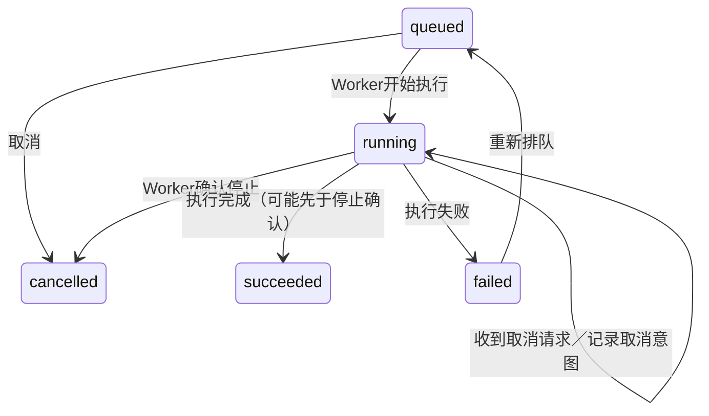

```mermaid
stateDiagram-v2
    queued --> running: Worker开始执行
    queued --> cancelled: 取消
    running --> running: 收到取消请求／记录取消意图
    running --> cancelled: Worker确认停止
    running --> succeeded: 执行完成（可能先于停止确认）
    running --> failed: 执行失败
    failed --> queued: 重新排队
```

取消请求只记录意图，任务仍处于running；Worker确认停止才算取消完成。期间任务可能先完成而进入succeeded。题目未规定succeeded能否重试，因此图中不添加该转换。
