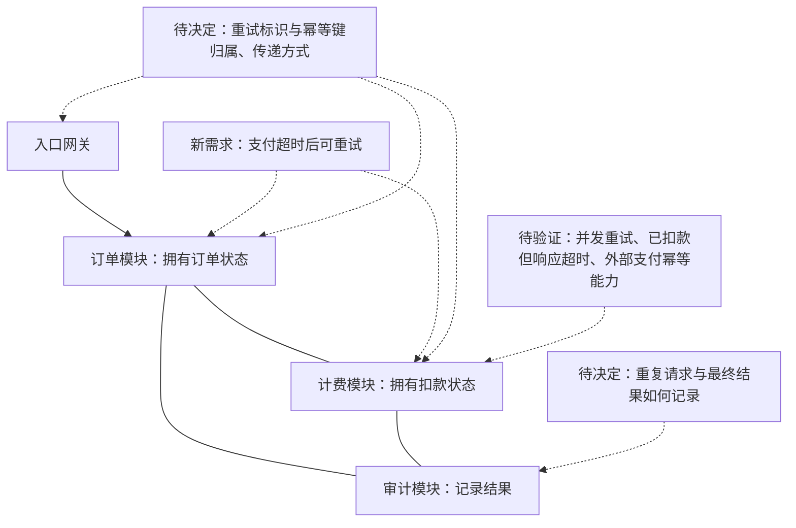

```mermaid
flowchart TB
    G[入口网关] --> O[订单模块：拥有订单状态]
    O --- B[计费模块：拥有扣款状态]
    O --- A[审计模块：记录结果]
    B --- A
    R[新需求：支付超时后可重试] -.-> O
    R -.-> B
    D[待决定：重试标识与幂等键归属、传递方式] -.-> G
    D -.-> O
    D -.-> B
    V[待验证：并发重试、已扣款但响应超时、外部支付幂等能力] -.-> B
    E[待决定：重复请求与最终结果如何记录] -.-> A
```

实线表示已知职责的关联，不指定调用顺序；虚线表示评审影响及待定项。计费需保证同一笔支付重试不重复扣款，订单需明确超时后的状态与结果处理，审计需明确记录规则。现有资料不足以认定已有幂等保证；应验证幂等记录与扣款的一致性，以及外部支付方的保证。
