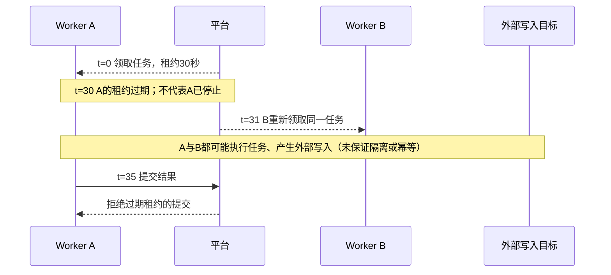

```mermaid
sequenceDiagram
    participant A as Worker A
    participant P as 平台
    participant B as Worker B
    participant E as 外部写入目标
    P-->>A: t=0 领取任务，租约30秒
    Note over A,P: t=30 A的租约过期；不代表A已停止
    P-->>B: t=31 B重新领取同一任务
    Note over A,E: A与B都可能执行任务、产生外部写入（未保证隔离或幂等）
    A->>P: t=35 提交结果
    P-->>A: 拒绝过期租约的提交
```

“任务只执行一次”不成立：租约过期后 A 仍可能继续执行，B 又领取了同一任务。拒绝 A 的结果提交不能撤销或阻止其外部写入；重复副作用是可能的，并非题目已证实发生。

依据：题目给定时序与提交规则。未渲染验证。
