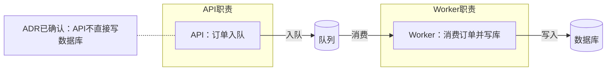

```mermaid
flowchart LR
    subgraph API职责
        A[API：订单入队]
    end
    Q[(队列)]
    subgraph Worker职责
        W[Worker：消费订单并写库]
    end
    D[(数据库)]
    A -->|入队| Q
    Q -->|消费| W
    W -->|写入| D
    N[ADR已确认：API不直接写数据库]
    N -.- A
```

事实：API 入队，Worker 消费并写库；ADR 只确认 API 不直接写数据库。队列是否为提升吞吐、隔离故障或其他原因而选用，输入未提供依据，尚未确认，不能由职责图反推设计原因。

依据：题目中的行为与 ADR 摘要。未渲染验证。
