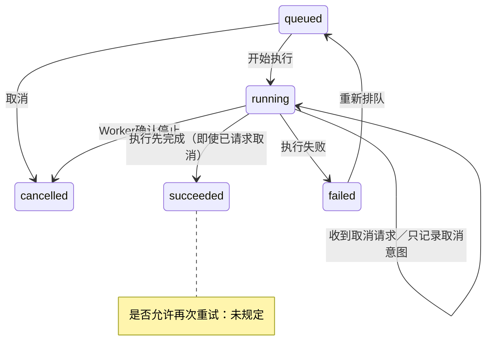

```mermaid
stateDiagram-v2
    queued --> running: 开始执行
    queued --> cancelled: 取消
    running --> running: 收到取消请求／只记录取消意图
    running --> cancelled: Worker确认停止
    running --> succeeded: 执行先完成（即使已请求取消）
    running --> failed: 执行失败
    failed --> queued: 重新排队
    note right of succeeded
        是否允许再次重试：未规定
    end note
```

取消请求只记录意图，任务仍为 `running`；Worker 确认停止才是取消完成，进入 `cancelled`。执行可能抢先完成并进入 `succeeded`，所以请求取消不保证最终取消。图中“开始执行／执行失败”是按状态名称推定的常规转移；其具体触发条件未提供。未将 `succeeded` 的重试画成已确认转移。

依据：题目状态规则。未渲染验证。
