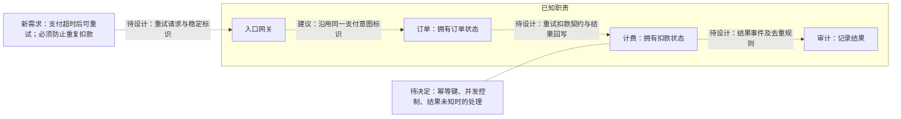

框内是题目已知职责；虚线是评审建议和待决定接口，现有调用关系未提供。订单状态仍由订单管理，扣款去重应在计费边界明确契约。

需决定：幂等键按哪个支付意图生成、重试如何复用、不同金额如何拒绝、保存期限；计费如何原子地处理并发同键请求，并返回既有结果。超时不证明扣款失败，结果未知时需查询或对账再决定后续动作。若扣款跨越外部系统，本地去重还需与外部幂等或隔离保证配合，不能仅靠缓存承诺不重复。

需验证：扣款成功但响应丢失、并发重试、去重记录与扣款之间崩溃、重复结果事件；确认只产生一次实际扣款，订单与审计最终反映同一结果。现有幂等设计资料未提供，上述方案尚未确认。

依据：题目职责决定与新需求。未渲染验证。
