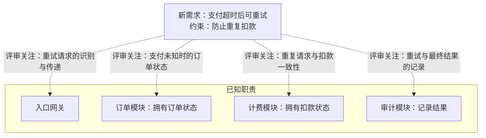
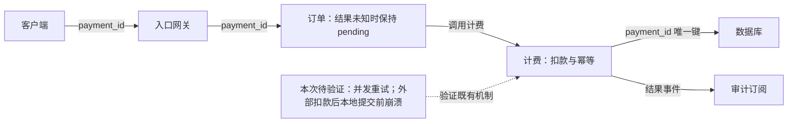
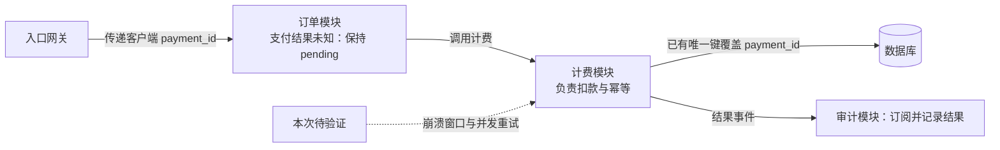

# 0.2.0 与 0.3.0 的独立回归输出

每版由独立无历史会话生成，未改写。相同题目，生成阶段不联网或渲染。这里只汇集原文。

## 05-scope

系统有入口网关、订单模块、计费模块和审计模块。已有决定：订单拥有订单状态，计费拥有扣款状态，审计记录结果。新需求允许支付超时后重试，必须防止重复扣款。没有现成的幂等设计资料。请用图帮助评审影响边界，区分已知职责和需要决定/验证的地方。简短中文，不写项目文档。

### v020


方框职责来自题目；虚线是评审范围，不代表已确认调用关系。新需求是支付超时后可重试、防止重复扣款；超时只说明结果未知，不能当作扣款失败。

需要决定：同一支付的稳定幂等标识与传递方式、幂等责任归属、并发防重与结果复用契约，以及未知结果如何查询/对账并更新订单。计费拥有扣款状态，建议优先评审其承担防重的方案，尚未确认。

重点验证：并发重试、外部已扣款但本地提交前崩溃、结果丢失后的重试。仅本地去重未必覆盖外部扣款窗口；需核实外部接口能力及恢复路径。审计只记录结果的已知职责不能自动证明其负责支付恢复。

来源：题目提供的职责与需求；幂等资料输入未提供。未渲染验证。


### v030



依据：题述职责；虚线仅表示评审关注，不表示模块调用链。图未渲染验证。

超时只表示未及时得到结果，不能据此认定扣款失败。当前关键工作：

- **待核实**：查现有重试/幂等契约和实现，确认同一支付如何识别、标识如何传递、并发如何处理；没有设计资料不代表没有机制。
- **待决策（核实后发现不足时）**：明确幂等责任、标识范围与有效期、结果未知时的查询/恢复方式，以及订单状态和审计记录如何反映最终结果。
- **待验证**：覆盖并发重试、扣款成功但响应丢失、外部已扣款但本地提交前崩溃；核对实际扣款次数及最终状态能否收敛。现有方案查明后再判断是否满足要求。


## 03-diff

旧逻辑：每次save都write。新逻辑：内容未变化时直接返回缓存；变化时write再失效缓存。用最容易看懂的方式说明改动。请简短中文回答，不写项目文档。

### v020

```diff
 on(save)
+  if content is unchanged
+    return cached result
   write content
+  invalidate cache
```

未变化时直接复用缓存；变化时先写入，再失效缓存。来源：题目给出的新旧逻辑。


### v030

```diff
 on(save)
+  if content is unchanged
+    return cached result
   write content
+  invalidate cache
```

未变化时直接复用缓存；变化时先写入，再使缓存失效。


## 06-existing

评审支付超时重试需求。已有设计记录明确：入口网关向订单模块传递客户端payment_id；订单调用计费，计费负责扣款和幂等，已有数据库唯一键覆盖payment_id；审计订阅计费的结果事件。订单在支付结果未知时保持pending。尚未提供“外部已扣款但本地提交前崩溃”和“并发重试”的测试结果。请用图解释当前职责和本次需要做的工作，不重新设计已确认机制。简短中文，不写项目文档。

### v020



实线关系与职责来自已有设计记录；虚线是本次验证工作，不改动已确认的职责和机制。

补齐两类测试及恢复证据：

- **并发重试**：同一 `payment_id` 并发到达，核对外部实际扣款次数、计费返回结果及订单最终状态。唯一键约束本地记录，并不能单独证明外部调用不会重复。
- **外部已扣款、本地提交前崩溃**：注入该故障后再重试，核对既有查询/恢复路径是否收敛且不再次扣款；结果未确认前订单保持 `pending`，确认后核对结果事件与审计记录。

测试结果尚未提供，不能宣布“仅扣款一次”已获验证。外部调用与本地提交如何衔接、具体恢复路径需核实已有实现；验证发现缺口再提出修正，不重新设计已确认机制。

来源：题目转述的设计记录及测试缺口。未渲染验证。


### v030



依据：已有设计记录（题述）；图未渲染验证。继续沿用已确认的标识传递、计费幂等、唯一键、事件订阅和 pending 机制。

本次补齐两类证据：

- **崩溃恢复**：在外部已扣款、本地尚未提交时注入崩溃，再恢复并重试；核对外部扣款次数、计费结果、订单从 pending 的后续收敛和审计结果。
- **并发重试**：同时提交同一 payment_id，检查实际扣款次数、唯一键冲突处理与各请求结果是否一致，并核对订单和审计最终结果。

唯一键覆盖 payment_id 是已知约束，尚不能单独证明跨外部扣款与本地提交的故障窗口安全。先跑测试并收集证据；若出现缺口，再针对失败路径修复，无需重新设计已确认机制。
