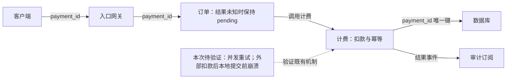

实线关系与职责来自已有设计记录；虚线是本次验证工作，不改动已确认的职责和机制。

补齐两类测试及恢复证据：

- **并发重试**：同一 `payment_id` 并发到达，核对外部实际扣款次数、计费返回结果及订单最终状态。唯一键约束本地记录，并不能单独证明外部调用不会重复。
- **外部已扣款、本地提交前崩溃**：注入该故障后再重试，核对既有查询/恢复路径是否收敛且不再次扣款；结果未确认前订单保持 `pending`，确认后核对结果事件与审计记录。

测试结果尚未提供，不能宣布“仅扣款一次”已获验证。外部调用与本地提交如何衔接、具体恢复路径需核实已有实现；验证发现缺口再提出修正，不重新设计已确认机制。

来源：题目转述的设计记录及测试缺口。未渲染验证。
