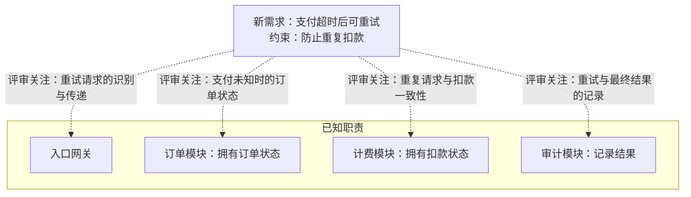

依据：题述职责；虚线仅表示评审关注，不表示模块调用链。图未渲染验证。

超时只表示未及时得到结果，不能据此认定扣款失败。当前关键工作：

- **待核实**：查现有重试/幂等契约和实现，确认同一支付如何识别、标识如何传递、并发如何处理；没有设计资料不代表没有机制。
- **待决策（核实后发现不足时）**：明确幂等责任、标识范围与有效期、结果未知时的查询/恢复方式，以及订单状态和审计记录如何反映最终结果。
- **待验证**：覆盖并发重试、扣款成功但响应丢失、外部已扣款但本地提交前崩溃；核对实际扣款次数及最终状态能否收敛。现有方案查明后再判断是否满足要求。
