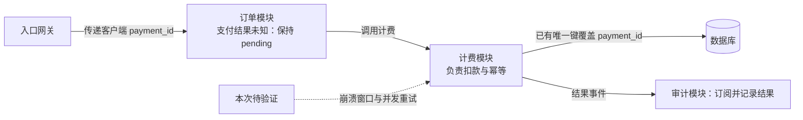

依据：已有设计记录（题述）；图未渲染验证。继续沿用已确认的标识传递、计费幂等、唯一键、事件订阅和 pending 机制。

本次补齐两类证据：

- **崩溃恢复**：在外部已扣款、本地尚未提交时注入崩溃，再恢复并重试；核对外部扣款次数、计费结果、订单从 pending 的后续收敛和审计结果。
- **并发重试**：同时提交同一 payment_id，检查实际扣款次数、唯一键冲突处理与各请求结果是否一致，并核对订单和审计最终结果。

唯一键覆盖 payment_id 是已知约束，尚不能单独证明跨外部扣款与本地提交的故障窗口安全。先跑测试并收集证据；若出现缺口，再针对失败路径修复，无需重新设计已确认机制。
