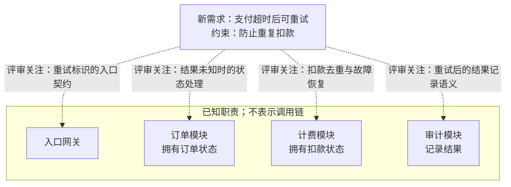
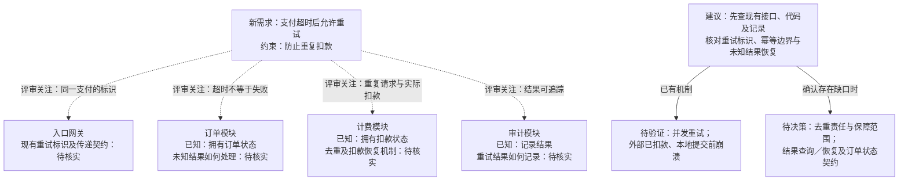
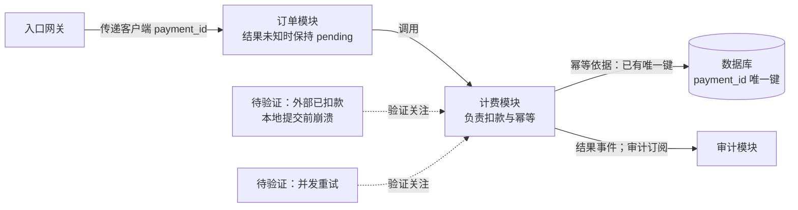
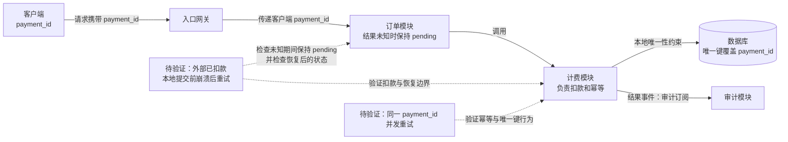

# 0.3.0 与 0.3.1 测试快照：原始回答对照

以下是未改写的原始回答。0.3.1 测试快照不含回归后补充的主体/所有权核对句；请先读 [结论与限制](README.md)。

## 05-scope

### v030

依据：题目提供的职责与新需求；虚线仅表示评审关注。当前没有幂等设计资料，不能据此认定系统没有幂等机制，也不能推出模块调用顺序。

- **待核实 → 必要时待决策：** 查现有接口、代码或记录，核对重试标识、传递与去重契约；若确有缺口，再决定标识范围及去重责任。计费拥有扣款状态，不自动证明它已承担幂等。
- **待核实 → 必要时待决策：** 核对超时后订单状态与扣款结果如何收敛，以及审计如何记录重试结果。超时只说明结果未知，不等于扣款失败。
- **待验证：** 确认方案后覆盖并发重试、外部已扣款但本地记录前崩溃、结果迟到等场景，检查实际扣款次数及订单、审计结果的一致性；不能仅凭本地去重就断言不会重复扣款。

未渲染验证。

### v031

虚线只表示评审关注；输入没有给出模块调用链。订单、计费、审计的状态所有权已确定，不能据此断定谁已实现幂等。没有设计资料也不等于没有实现，先核实现有契约，再针对确认的缺口作决定。

验证应检查同一支付的实际扣款次数与最终状态收敛；仅限制本地记录数量，不能直接证明外部只扣款一次。

依据：题目给定职责与新需求；图未渲染验证。

## 06-existing

### v030

依据：题目中的已有设计记录。职责、标识传递、唯一键和订阅机制已确认，本次复用这些机制；结果未知时订单继续保持 `pending`。

本次工作是补齐两类验证证据：

- **崩溃恢复：** 在外部扣款成功、计费本地提交前注入崩溃，再以同一 `payment_id` 重试。检查外部实际扣款次数、现有恢复路径如何取得最终结果，以及订单和审计是否按既有契约收敛。唯一键约束本地记录，单凭它不能证明外部扣款不会重复。
- **并发重试：** 同一 `payment_id` 并发请求，检查实际只扣款一次、唯一键冲突得到正确处理，各请求的结果符合现有契约。不要仅验证数据库最终只有一条记录。

测试结果尚未提供，当前结论是**待验证**。先核对现有实现并执行上述测试；只有发现机制不能满足需求时，才针对失败证据讨论修补方案。

未渲染验证。

### v031

职责与机制已由设计记录确认，本次重点是补齐两类测试证据：

- **崩溃后重试**：注入“外部扣款成功、本地提交前崩溃”，以同一 `payment_id` 重试，核对实际扣款次数、恢复结果、订单状态及审计记录。唯一键本身不能证明跨外部扣款与本地提交的原子性；测试中核对已有恢复路径。
- **并发重试**：同一 `payment_id` 同时发起请求，核对实际只扣一次、唯一键冲突的处理、各请求结果及订单最终状态；同时确认不同 `payment_id` 不被误去重。

尚未提供结果，不能宣称这些场景已通过。若测试暴露缺口，再根据失败证据修复对应实现；当前不重选已确认的幂等责任或唯一键机制。

依据：题目所述已有设计记录；图未渲染验证。
