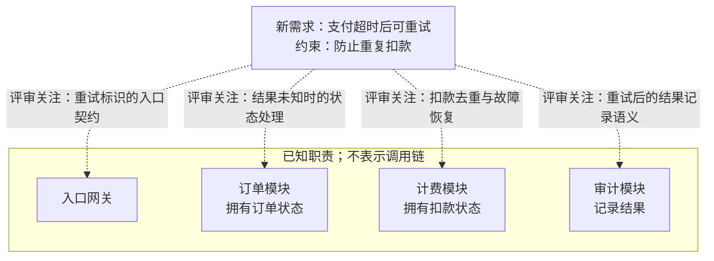

依据：题目提供的职责与新需求；虚线仅表示评审关注。当前没有幂等设计资料，不能据此认定系统没有幂等机制，也不能推出模块调用顺序。

- **待核实 → 必要时待决策：** 查现有接口、代码或记录，核对重试标识、传递与去重契约；若确有缺口，再决定标识范围及去重责任。计费拥有扣款状态，不自动证明它已承担幂等。
- **待核实 → 必要时待决策：** 核对超时后订单状态与扣款结果如何收敛，以及审计如何记录重试结果。超时只说明结果未知，不等于扣款失败。
- **待验证：** 确认方案后覆盖并发重试、外部已扣款但本地记录前崩溃、结果迟到等场景，检查实际扣款次数及订单、审计结果的一致性；不能仅凭本地去重就断言不会重复扣款。

未渲染验证。
