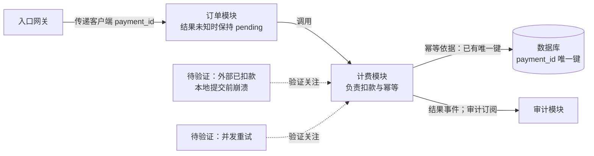

依据：题目中的已有设计记录。职责、标识传递、唯一键和订阅机制已确认，本次复用这些机制；结果未知时订单继续保持 `pending`。

本次工作是补齐两类验证证据：

- **崩溃恢复：** 在外部扣款成功、计费本地提交前注入崩溃，再以同一 `payment_id` 重试。检查外部实际扣款次数、现有恢复路径如何取得最终结果，以及订单和审计是否按既有契约收敛。唯一键约束本地记录，单凭它不能证明外部扣款不会重复。
- **并发重试：** 同一 `payment_id` 并发请求，检查实际只扣款一次、唯一键冲突得到正确处理，各请求的结果符合现有契约。不要仅验证数据库最终只有一条记录。

测试结果尚未提供，当前结论是**待验证**。先核对现有实现并执行上述测试；只有发现机制不能满足需求时，才针对失败证据讨论修补方案。

未渲染验证。
