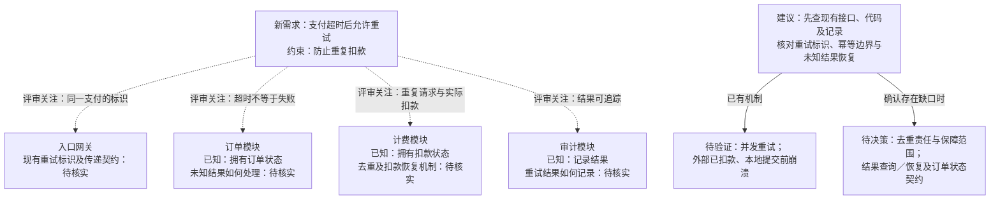

```mermaid
flowchart TB
    R[新需求：支付超时后允许重试<br/>约束：防止重复扣款]
    G[入口网关<br/>现有重试标识及传递契约：待核实]
    O[订单模块<br/>已知：拥有订单状态<br/>未知结果如何处理：待核实]
    B[计费模块<br/>已知：拥有扣款状态<br/>去重及扣款恢复机制：待核实]
    A[审计模块<br/>已知：记录结果<br/>重试结果如何记录：待核实]
    R -.评审关注：同一支付的标识.-> G
    R -.评审关注：超时不等于失败.-> O
    R -.评审关注：重复请求与实际扣款.-> B
    R -.评审关注：结果可追踪.-> A
    W[建议：先查现有接口、代码及记录<br/>核对重试标识、幂等边界与未知结果恢复]
    W -->|已有机制| V[待验证：并发重试；<br/>外部已扣款、本地提交前崩溃]
    W -->|确认存在缺口时| D[待决策：去重责任与保障范围；<br/>结果查询／恢复及订单状态契约]
```

虚线只表示评审关注；输入没有给出模块调用链。订单、计费、审计的状态所有权已确定，不能据此断定谁已实现幂等。没有设计资料也不等于没有实现，先核实现有契约，再针对确认的缺口作决定。

验证应检查同一支付的实际扣款次数与最终状态收敛；仅限制本地记录数量，不能直接证明外部只扣款一次。

依据：题目给定职责与新需求；图未渲染验证。
