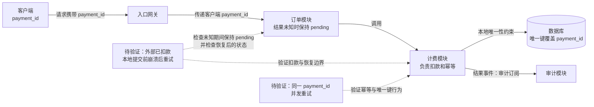

职责与机制已由设计记录确认，本次重点是补齐两类测试证据：

- **崩溃后重试**：注入“外部扣款成功、本地提交前崩溃”，以同一 `payment_id` 重试，核对实际扣款次数、恢复结果、订单状态及审计记录。唯一键本身不能证明跨外部扣款与本地提交的原子性；测试中核对已有恢复路径。
- **并发重试**：同一 `payment_id` 同时发起请求，核对实际只扣一次、唯一键冲突的处理、各请求结果及订单最终状态；同时确认不同 `payment_id` 不被误去重。

尚未提供结果，不能宣称这些场景已通过。若测试暴露缺口，再根据失败证据修复对应实现；当前不重选已确认的幂等责任或唯一键机制。

依据：题目所述已有设计记录；图未渲染验证。
