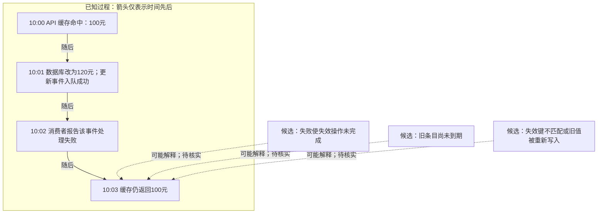
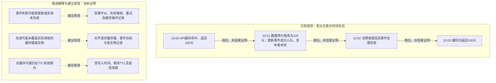
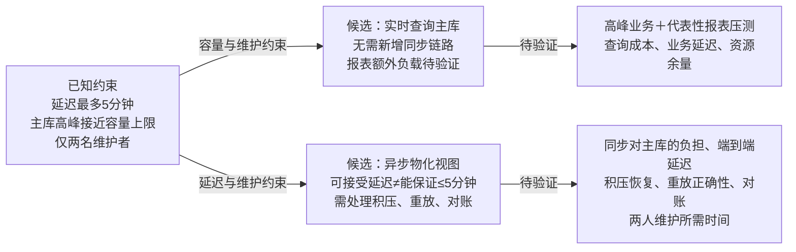
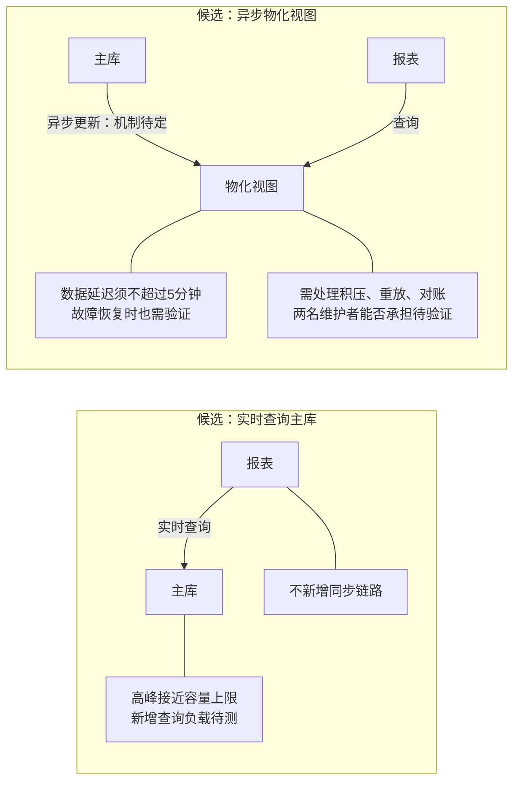

# 两题独立回归：0.3.2 与 0.3.3 实验稿

逐字汇集未改写的原文。每条件两份回答，每题各一次新会话；方法和结论见 [报告](README.md)。

## 07-incident

一次请求在10:00命中API缓存并返回价格100元；10:01数据库价格改为120元，更新事件成功写入队列；10:02消费者报告该事件处理失败，随后没有提供重试或缓存失效记录；10:03请求仍从缓存读到100元。缓存TTL为10分钟。请用图解释已知过程、候选原因和下一步排查，不把时间先后当作已证明的因果。简短中文，不写项目文档。

### v032

[原文件](outputs/v032/07-incident.md)

未渲染验证。时间线不能证明“消费失败导致旧价”；事件入队也不等于缓存已失效。未提供重试或失效记录，不代表这些操作没有发生。

下一步排查（建议）：

1. **核实事件处理链路**：按事件 ID 查异常、确认/重试/死信记录及失效执行结果，确认失败发生在失效之前还是之后。
2. **核实实际过期时间**：查同一缓存键的写入时间、剩余 TTL 和续期规则。TTL 为10分钟，但10:00是命中时间，不能据此断言10:10到期。
3. **验证失效与回填**：对齐读写和失效的缓存键、实例及值版本；检查失效后是否有旧值回填。用受控复现验证查到的候选原因。

### v033

[原文件](outputs/v033/07-incident.md)

目前能确认10:03读到旧价，不能确认由10:02的失败导致。随后未提供重试或失效记录，不等于它们没有发生。

TTL为10分钟，但10:00是命中时间，不能据此推算10:10到期。优先串联同一事件与缓存键的记录，再验证更新、重试和到期后的读值。

未渲染验证。

## 08-tradeoff

团队要为报表选择实时查询主库或异步物化视图。已有约束：用户能接受最多5分钟的数据延迟，主库在业务高峰接近容量上限，团队只有两名维护者。实时查询不需新增同步链路；物化视图需要处理积压、重放和对账。没有负载测试、报表查询成本和运维成本数据。请用图帮助比较这两个方案，给出有条件的建议与所需证据，不把候选方案当成已决定。简短中文，不写项目文档。

### v032

[原文件](outputs/v032/08-tradeoff.md)

建议优先验证物化视图：5分钟容忍度提供空间，主库容量风险使分离报表负载更值得评估；这尚不是选型结论。

- 若物化视图在高峰和故障恢复中仍满足≤5分钟、结果正确，且两人能承担运维，可倾向采用。
- 若实时查询压测证明主库有足够余量、业务延迟达标，可倾向采用，减少同步维护负担。
- 若两者都未通过，先限制报表并发或成本并重新评估，不能用“允许延迟”替代可靠性证据。

缺少负载、查询成本和运维成本数据，当前选择待决策。图未渲染验证。

### v033

[原文件](outputs/v033/08-tradeoff.md)

未渲染验证。两种方案均未决定；物化视图可能减少报表直接查询主库的压力，但同步和构建仍有成本。

**有条件建议：优先验证物化视图。** 5分钟延迟容忍度提供了空间，主库高峰容量则限制实时查询；但只有证明延迟达标、恢复可靠且两人能维护，才建议选择它。若代表性高峰压测证明实时查询仍有足够余量、业务延迟可接受，则实时方案因少一条同步链路更合适。两者都不达标时，应调整报表范围或容量后再评估。

选择前需要三组证据：

- **查询成本与容量：** 用真实报表查询、数据规模和并发压测，比较业务延迟、主库CPU/IO与容量余量；物化方案计入同步及构建负载。
- **新鲜度与正确性：** 测量端到端数据延迟，模拟积压、停机和重放，验证5分钟上限及对账结果，明确超限时的产品行为。
- **维护成本：** 演练告警、恢复和对账，记录维护工时、故障处理时间及基础设施成本，确认两人团队可承担。

