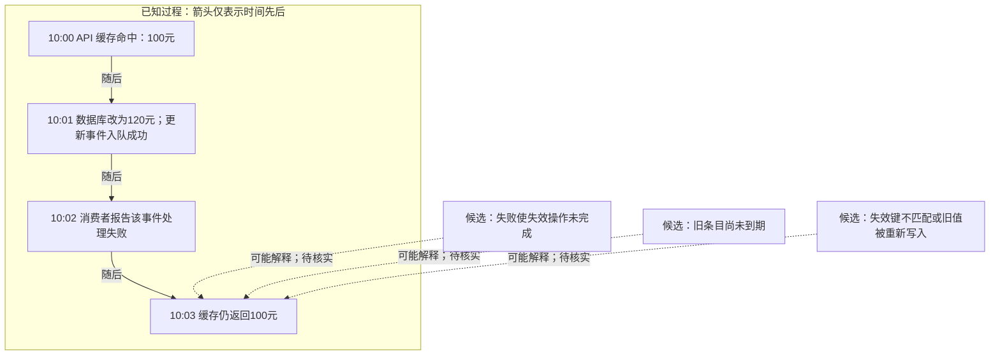

未渲染验证。时间线不能证明“消费失败导致旧价”；事件入队也不等于缓存已失效。未提供重试或失效记录，不代表这些操作没有发生。

下一步排查（建议）：

1. **核实事件处理链路**：按事件 ID 查异常、确认/重试/死信记录及失效执行结果，确认失败发生在失效之前还是之后。
2. **核实实际过期时间**：查同一缓存键的写入时间、剩余 TTL 和续期规则。TTL 为10分钟，但10:00是命中时间，不能据此断言10:10到期。
3. **验证失效与回填**：对齐读写和失效的缓存键、实例及值版本；检查失效后是否有旧值回填。用受控复现验证查到的候选原因。
