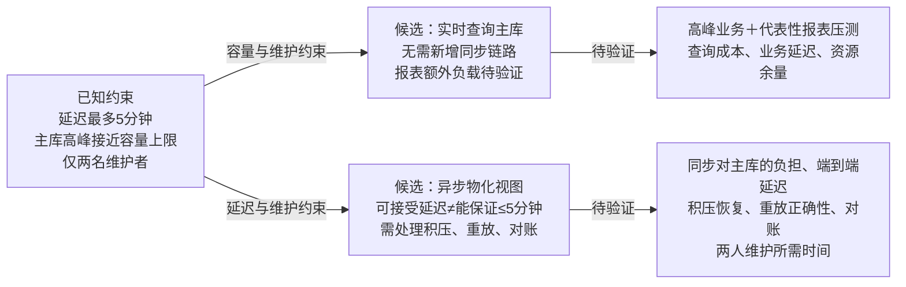

建议优先验证物化视图：5分钟容忍度提供空间，主库容量风险使分离报表负载更值得评估；这尚不是选型结论。

- 若物化视图在高峰和故障恢复中仍满足≤5分钟、结果正确，且两人能承担运维，可倾向采用。
- 若实时查询压测证明主库有足够余量、业务延迟达标，可倾向采用，减少同步维护负担。
- 若两者都未通过，先限制报表并发或成本并重新评估，不能用“允许延迟”替代可靠性证据。

缺少负载、查询成本和运维成本数据，当前选择待决策。图未渲染验证。
