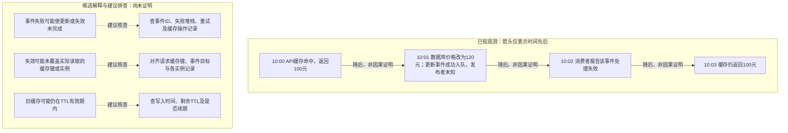

```mermaid
flowchart TB
  subgraph O[已知观测：箭头仅表示时间先后]
    A[10:00 API缓存命中，返回100元]
    B[10:01 数据库价格改为120元；更新事件成功入队，发布者未知]
    C[10:02 消费者报告该事件处理失败]
    D[10:03 缓存仍返回100元]
    A -->|随后，非因果证明| B
    B -->|随后，非因果证明| C
    C -->|随后，非因果证明| D
  end
  subgraph H[候选解释与建议排查：尚未证明]
    E[事件失败可能使更新或失效未完成]
    F[查事件ID、失败堆栈、重试及缓存操作记录]
    G[失效可能未覆盖实际读取的缓存键或实例]
    I[对齐请求缓存键、事件目标与各实例记录]
    J[旧缓存可能仍在TTL有效期内]
    K[查写入时间、剩余TTL及是否续期]
    E -. 建议核查 .-> F
    G -. 建议核查 .-> I
    J -. 建议核查 .-> K
  end
```

目前能确认10:03读到旧价，不能确认由10:02的失败导致。随后未提供重试或失效记录，不等于它们没有发生。

TTL为10分钟，但10:00是命中时间，不能据此推算10:10到期。优先串联同一事件与缓存键的记录，再验证更新、重试和到期后的读值。

未渲染验证。
